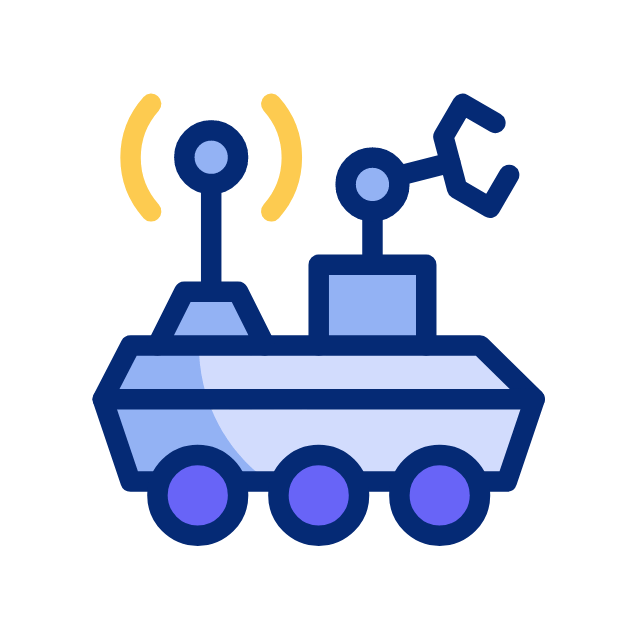

### Hi there :raised_hand_with_fingers_splayed: 

I am Arul. I am a robotics perception researcher working on object detection, pose estimation, and pose representations.

<!--
**SelvamArul/SelvamArul** is a ✨ _special_ ✨ repository because its `README.md` (this file) appears on your GitHub profile.

Here are some ideas to get you started:
-->
- :mortar_board: I’m a Ph.D. candidate at the [Autonomous Intelligent Systems lab, University of Bonn](https://www.ais.uni-bonn.de/~periyasa/)
- Here are some of the projects I worked on:
    - [Stillleben](https://github.com/AIS-Bonn/stillleben)
    - [SynPick](https://www.ais.uni-bonn.de/datasets/synpick/)
    - [Amazon Robotics Challenge](https://www.ais.uni-bonn.de/nimbro/Picking/)
    - [MBZIRC](https://www.ais.uni-bonn.de/nimbro/MBZIRC/)
    - [CENTAURO](https://www.ais.uni-bonn.de/nimbro/Explorer/)

https://github.com/SelvamArul/SelvamArul/assets/7311434/cc2bb57d-6b24-4c6d-a71e-97b06ee1ad9b

